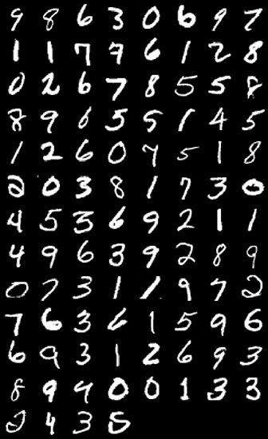
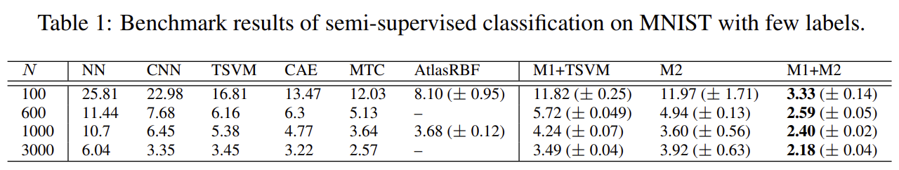
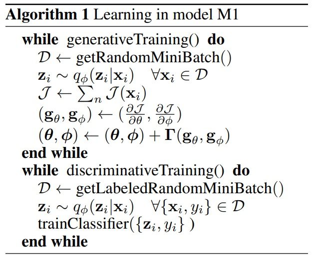
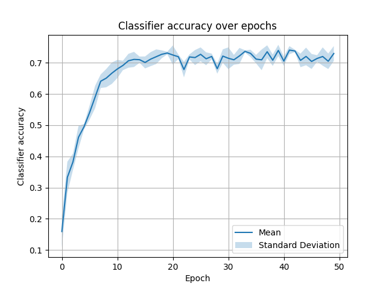
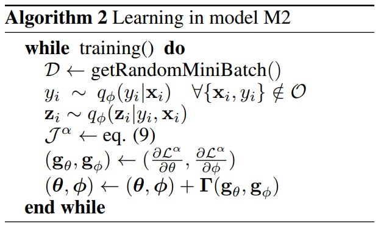

Reproducibility Project
--------------
CS4240 Deep Learning 

##### Group 6: Dimitri Stallenberg & Gijs de Jong


## Introduction

For our reproducibility project of Deep Learning, we decided to tackle _Semi-supervised Learning with Deep Generative Models_ by Kindgma et al available [here](https://arxiv.org/abs/1406.5298). 
The paper introduces two new models (M1 and M2), and their combination, that allow for effective generalisation from small labelled data sets to large unlabelled ones.
The main dataset used to evaluate the performance of the models is [MNIST](http://yann.lecun.com/exdb/mnist/), consisting of a large number of handwritten numbers. A sample of this dataset can be seen in the image below.



Before we dive into the goal of our reproducibility project, you might wonder why reproducing a paper is useful to begin with. 
One could argue that spending time on developing newer models might be better. 
Although there is definitely some truth in that, reproducing existing work is crucial to keeping the machine learning (or specifically deep learning) research environment healthy.
Showing popular papers can be reproduced further increases confidence in their results and initiatives such as [Reproduced Papers](https://reproducedpapers.org/) show that reproduction is becoming ever more popular. 

The main goal of our reproducibility project is to reproduce the classification results from the two models given in the paper. This resolves around values from table 1, shown in the image below.



Although not specified, we assume the values here represent classification errors given in percentages. The values of _N_ represent the number of labelled images used to train the models.
For example, model M1 achieves an error of 11.82% (+- 0.25) for _N_=100.

Concretely, we will attempt to reproduce the classification errors for the two models proposed by the paper for the given values of _N_.
To do so, we will reimplement the described models in [PyTorch](https://pytorch.org/) and run them on MNIST for verification.
Although the paper does provide source code, the frameworks it depends on are outdated to such a degree that it can not be run nor rewritten anymore.
The next sections will dive into our implementations for the models (M1 and M2) and discuss the results. After discussing our results for M1 and M2, we will give our thoughts on the combination of the two as is proposed in the paper.

## Evaluation setup

First, we set some general variables and load the MNIST data.
```python
epochs = 50
batch_size = 100
lr = 0.0003
N = 100

train_loader, test_loader = load_data(batch_size)
```
To see how the data is actually loaded please look in `load_data.py`.

## Model M1

The M1 model is defined according to the pseudocode given in the paper. This is shown in the figure below. Next, we will discuss our implementation and how it matches with the pseudocode.



Here we define the model which is a Variational Auto-Encoder (VAE).
```python
class VAE(nn.Module):
    def __init__(self, features, hidden, latent_features):
        super(VAE, self).__init__()

        # encoder
        self.enc1 = nn.Sequential(
            nn.Linear(in_features=features, out_features=hidden, bias=True),
            nn.Softplus(),
            nn.Linear(in_features=hidden, out_features=hidden, bias=True),
            nn.Softplus()
        )
        self.enc_mean = nn.Sequential(
            nn.Linear(in_features=hidden, out_features=latent_features, bias=True),
        )

        self.enc_log_var = nn.Sequential(
            nn.Linear(in_features=hidden, out_features=latent_features, bias=True),
        )

        # decoder
        self.dec1 = nn.Sequential(
            nn.Linear(in_features=latent_features, out_features=hidden, bias=True),
            nn.Softplus(),
            nn.Linear(in_features=hidden, out_features=hidden, bias=True),
            nn.Softplus(),
        )
        self.dec2 = nn.Sequential(
            nn.Linear(in_features=hidden, out_features=features, bias=True),
            nn.Sigmoid(),
        )

    def forward(self, x):
        # encoding
        x = self.enc1(x)
        mu = self.enc_mean(x)
        log_var = self.enc_log_var(x)

        std = torch.exp(0.5 * log_var)
        eps = torch.randn_like(std)
        z = mu + (eps * std)

        # decoding
        x = self.dec1(z)
        reconstruction = self.dec2(x)
        return reconstruction, z, mu, log_var
```
In addition to this VAE model we will use a SVM classifier which uses the latent features to classify the digit in the image.
An example on how to take a balanced subsample of the data can be found in this stackoverflow post.

> https://stackoverflow.com/questions/23455728/scikit-learn-balanced-subsampling

```python
class Classifier:
    def __init__(self):
        self.classifier = svm.SVC(C=1, kernel='rbf', break_ties=True, cache_size=8000)
        self.train_vectors = None
        self.train_types = None

    def train(self, vectors, types):
        if self.train_vectors is None:
            self.train_vectors = vectors
            self.train_types = types

        self.train_vectors = np.concatenate((self.train_vectors, vectors), axis=0)
        self.train_types = np.concatenate((self.train_types, types), axis=0)

    def fit(self, N):
        # balanced sub sample
        x, y = self.balanced_subsample(self.train_vectors, self.train_types, float(N) / self.train_vectors.shape[0])
        self.classifier.fit(x, y)

    def validate(self, vectors, types):
        res = self.classifier.score(vectors, types)

        return res
```

Here we setup the model, the optimizer and the main loss function.
```python
features = 784 
hidden = 600
latent_features = 50
model = VAE(features, hidden, latent_features)

optimizer = optim.Adam(model.parameters(), lr=lr, betas=(0.1, 0.001))
criterion = nn.BCELoss(reduction='sum')
```

Now let's define the loss function. This is the Binary Cross Entropy loss minus the Kullback-Leibler divergence.

```python
def custom_loss(bce_loss, mu, logvar):
    BCE = bce_loss
    KLD = -0.5 * torch.sum(1 + logvar - mu.pow(2) - logvar.exp())
    return BCE + KLD
```
Next, we define the training function. Which trains the model using the data in the dataloader given as argument.

```python
def train(model, classifier, dataloader):
    model.train()
    running_loss = 0.0
    for i, (data, labels) in enumerate(dataloader):
        data = data.view(data.size(0), -1)
        # reset gradient
        optimizer.zero_grad()
        # pass data forward in the model
        reconstruction, z, mu, logvar = model(data)
        # calculate loss
        bce_loss = criterion(reconstruction, data)
        loss = custom_loss(bce_loss, mu, logvar)
        running_loss += loss.item()
        # back propogate
        loss.backward()
        # update weights
        optimizer.step()

        classifier.train(z.detach().cpu().numpy(), labels.numpy())

    train_loss = running_loss / len(dataloader.dataset)

    # Fit the SVM classifier
    classifier.fit(N)

    return train_loss

```
Here we define the test/validation function.
```python
def test(model, classifier, dataloader):
    model.eval()
    running_loss = 0.0
    classifier_loss = 0.0

    # no_grad() is used to make sure that the gradients are not updated during the test/validation phase
    with torch.no_grad():
        for i, (data, labels) in enumerate(dataloader):
            data = data.view(data.size(0), -1)
            # forward the data to the model
            reconstruction, z, mu, logvar = model(data)

            # calculate loss
            bce_loss = criterion(reconstruction, data)
            loss = custom_loss(bce_loss, mu, logvar)
            running_loss += loss.item()
            
            # Validate classifier
            loss = classifier.validate(z.detach().cpu().numpy(), labels.numpy())
            classifier_loss += loss * z.shape[0]

    classifier_loss = classifier_loss / len(dataloader.dataset)
    test_loss = running_loss / len(dataloader.dataset)
    
    return test_loss, classifier_loss
```
Finally, our main for loop
```python
for epoch in range(epochs):
    print(f"Epoch {epoch + 1} of {epochs}")
    classifier = Classifier()
    train_epoch_loss = train(model, classifier, train_loader)
    test_epoch_loss, classifier_epoch_loss = test(model, classifier, test_loader)
    print(f"Train Loss: {train_epoch_loss:.4f}")
    print(f"Val Loss: {test_epoch_loss:.4f}")
    print(f"Classifier accuracy: {classifier_epoch_loss:.4f}")

```

### Results
To evaluate the results of our implementation of the M1 model, we first had to determine an appropriate number of epochs to run the algorithm. 
As running 3000 epochs would take multiple days, accoring to [the repo](https://github.com/dpkingma/nips14-ssl), we decided investigating multiple runs of 50 epochs would be better (and feasible).
The reason for choosing 50 epochs specifically is that the accuracy of the classifiers showed to be relatively consistent by then. An example of that is shown in the figure below.



The accuracy of the classifier of the M1 model was measured by computing the average for each value for _N_ as stated in the paper (100, 600, 1000 and 3000) over 5 runs. The classification for a specific run is the average of the last three values reported.
The table below shows the results for model M1.

| N    | M1 |
|------|----|
| 100  | 25.8%  |
| 600  | 10.8%  |
| 1000 | 8.8%  |
| 3000 | 5.4%  |

The results show that while our implementation came relatively close to that of the paper, the classification errors are not as small. 
While this may be because of our smaller number of epochs run, we feel the final value did not change significantly in the last 10 epochs, and thus doubt whether the reported values can be reached with our implementation.
Concretely, our error for _N=100_ is around 13% higher, for _N=600_ around 5% higher, for _N=1000_ around 4% higher and for _N=3000_ around 2% higher.
The differences show that for larger _N_, the classification errors become more similar to the original results.
However, in general we can conclude that the results are not reproducible with the given details. 


## Model M2

The M2 model is defined according to the pseudocode given in the paper. This is shown in the figure below. Next, we will discuss our implementation and how it matches with the pseudocode.



This model is fairly similar, so we will only highlight the differences.

First we need to remove anything that has something to do with the SVM classifier.

Next, we need to add an additional encoder layer.

```python
    self.enc_pi = nn.Sequential(
        nn.Linear(in_features=hidden, out_features=10, bias=True),
    )
```

Now the forward function also has to be changed.
Simply add the following line and return pi.

```python
        pi = self.enc_pi(x)
```

Now in the train function replace the `loss = custom_loss(bce_loss, mu, logvar)` line with the following. 
The value of _H_ represents the function _H_ as given in equation 7 in the paper. 
This representation is nothing more than our interpretation of it, as there is no formal specification of what _H_ in the paper actually is. 

```python
    with torch.no_grad():
        label_correct += (torch.argmax(pi, 1) == labels).sum()

    if i < N:
        loss = custom_loss(bce_loss, mu, logvar)
        loss += second_criterion(pi, labels)
    else:
        loss = custom_loss(bce_loss, mu, logvar)
        U = 0.0

        for y in range(10):
            y_labels = torch.tensor([y for _ in range(pi.shape[0])]).cuda()
            L = loss + second_criterion(pi, y_labels)

            q_y_x = pi[:, y].sum()
            H = torch.heaviside(pi[:, y], torch.tensor([0.0], requires_grad=False).cuda())

            U = U + q_y_x + L + H.sum()
        
        loss = U
```

Replace the same line in the test function with the following code:

```python
label_correct += (torch.argmax(pi, 1) == labels).sum()

second_loss = second_criterion(pi, labels)
loss = custom_loss(bce_loss, mu, logvar) + second_loss
```

That concludes our implementation for model M2.

### Results
The table below shows the results for model M2.

| N    | M2 |
|------|----|
| 100  | 89.9%  |
| 600  | 5.85%  |
| 1000 | 5.54%  |
| 3000 | 5.60%  |

The results show that there is a very large gap for smaller values of _N_, namely for _N=100_. Higher values are more similar to the results in the paper.
Our error for _N=100_ is around 77.9% higher, for _N=600_ around 0.9% higher, for _N=1000_ around 1.9% higher and for _N=3000_ around 1.7% higher.
While similar, we also feel we would not be able to reproduce the same classification errors when running the model for more epochs.
This is likely also due to details missing and thus our implementation differing from the proposed method.

## Stacked Models M1+M2
Our results for models M1 and M2 are already very different from that of the paper, mainly caused by the lack of details in their specifications.
In addition to the results being different, we are also certain that there are implementation aspects that are too different to yield similar results.
For that reason we feel there is no useful reason to look at the results for the stacked model.


# Conclusion
Reproducing papers is becoming ever more important in the field of Deep Learning. 
This project taught us a lot about what it takes to reproduce a paper and how authors should keep this in mind.
We feel that the authors of the discussed papers should have specified more details regarding their models, and otherwise provide code with sufficient comments to explain it.
Limitations in our understanding of the paper and details given are to a large degree the reason why we could not reproduce the original results.
In any case, we learned a lot about how MNIST classifiers work and can be implemented, and it was a fun challenge to make the most of the work we had.
The paper sparked our curiosity and we are intrigued to know whether full specification and details would allow a correct implementation in PyTorch to reproduce the original results.